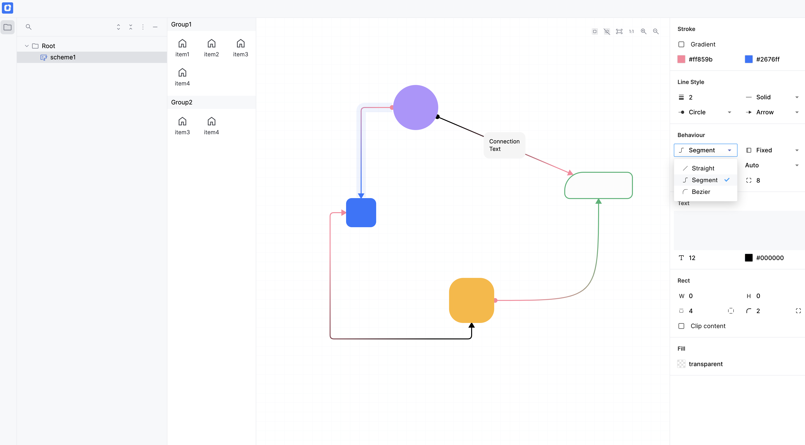

# 🧩 Visual Scheme Editor Example using @foblex/flow

This project demonstrates how to build an interactive **node-based diagram editor** using the [@foblex/flow](https://github.com/Foblex/f-flow) Angular library.

It includes features such as zooming, drag & drop, node creation, customizable connections, and full control over layout and behavior.

Additionally, this example integrates:
- ✅ Persistent **IndexedDB** state saving
- 🎨 Custom **color picker** (inspired by Figma)
- 🖼️ Custom **image picker** for background or node assets
- 🧱 UI components built using **Angular Material**

[DEMO](https://foblex.github.io/f-scheme-editor)

  

<!-- Video available in the repository -->

---

### 🎬 Preview (Video)

You can also watch a short demo video (example.mov) available in the repository:

[LINK](https://youtu.be/G66MoUwrIbo)

## Used library capabilities

- [x] Zoom (with mouse wheel, double click, and buttons)
- [x] Select elements (single selection using the mouse, multiple selection using the Shift key and the mouse)
- [x] Drag and drop
- [x] Create new connections
- [x] Reassign connections
- [x] Connection text
- [x] Change connection markers
- [x] Change connection type
- [x] Change connection behavior
- [x] Change connection style
- [x] Change connection text
- [x] Create new nodes using drag and drop from the palette
- [x] Draggable background
- [x] Change background
- [x] Save/load flow state from localStorage
- [x] Custom image picker (like in Figma)
- [x] Custom color picker
- [x] Angular Material UI components

## Installation

Run `npm install` to install the required packages.

## Development server

Run `ng serve` for a dev server. Navigate to `http://localhost:4200/`. The application will automatically reload if you change any of the source files.

## License

This example is distributed under the MIT License. See the LICENSE file for more information.
